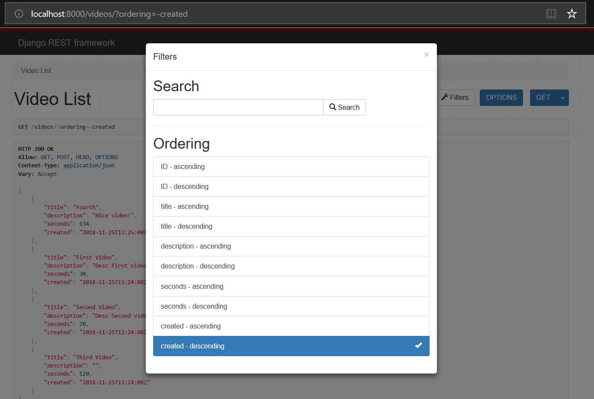

# MyDream.API.Video
This repository contains the source code of Video APIs.

## Starting the database
You need to execute the database script to `db.sqlite3` before starting the project. 
The scripts can be localized at `src\scripts_db\video.sql` and the database at `src\db.sqlite3`.

## Executing the Video API 
To start the project, you need to access the folder `src` and to execute `python manage.py runserver` in terminal.

## Acessing the Video API
You can access the Video API at address 
`http://localhost:8000/videos/`

